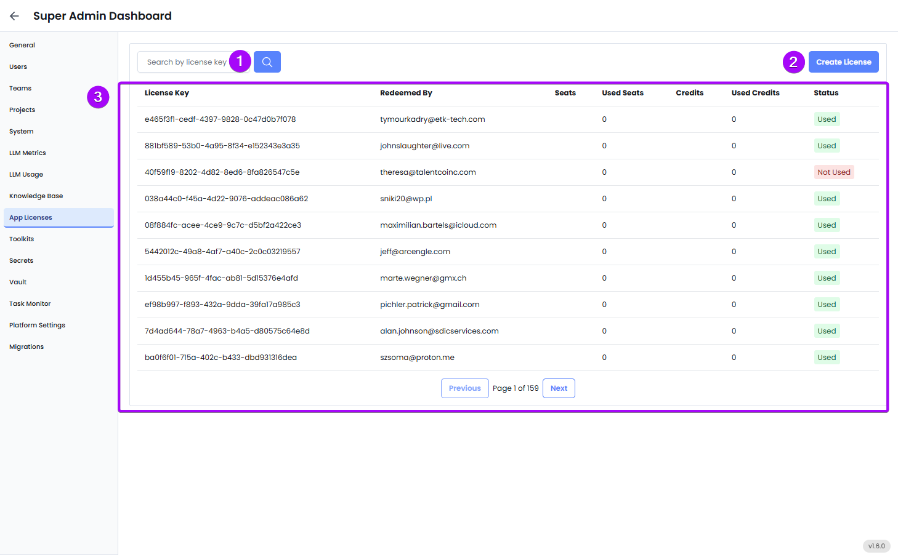

The **App Licenses** tab is where you can track, manage, and generate license keys for users who need access to EKB’s platform or its related services. Each license represents permission to use a set number of seats or credits, and this view helps you stay in control of usage, distribution, and onboarding.

---

**1. Search**

- Use the **search bar** to filter by license key
- Navigate through multiple pages if you have a large number of licenses (e.g., hundreds of users)

**2. Create License**

1. Click the **Create License** button to issue a new license. 
2. Enter the **Number of Seats**.
3. Enter the **Number of Credits**.

**3. Licenses List**

The main table shows a list of all licenses currently issued, along with key usage details:

- **License Key**: A unique identifier for each license instance.
- **Redeemed By**: The email of the user who claimed or was assigned the license.
- **Seats**: The total number of allowed seats under this license.
- **Used Seats**: How many of those seats have been assigned to users.
- **Credits**: Optional — shows if the license includes credit limits (e.g., AI usage credits).
- **Used Credits**: Tracks how much of those credits have been consumed.
- **Status**: Indicates whether the license is currently in use (Used) or still inactive (Not Used).

This gives you an immediate snapshot of who is using what, and whether your licenses are being fully utilized.

---

### Best Practices for Admins

- Regularly review **unused** licenses and redistribute them as needed
- Monitor users or teams with high usage to evaluate ROI or potential upgrades
- Tag licenses to departments, clients, or billing groups for easy reporting
- Use the “Credits” field to manage token-based or resource-based pricing plans

---

### Example Scenario

Your organization buys 50 GPT-4 access seats under a usage-based license. You create licenses here and assign them to 50 different team leads across departments. As usage grows, you periodically review the App Licenses tab to:

- See who’s actively using their seats
- Identify unused slots to reassign
- Track how many GPT credits have been consumed
