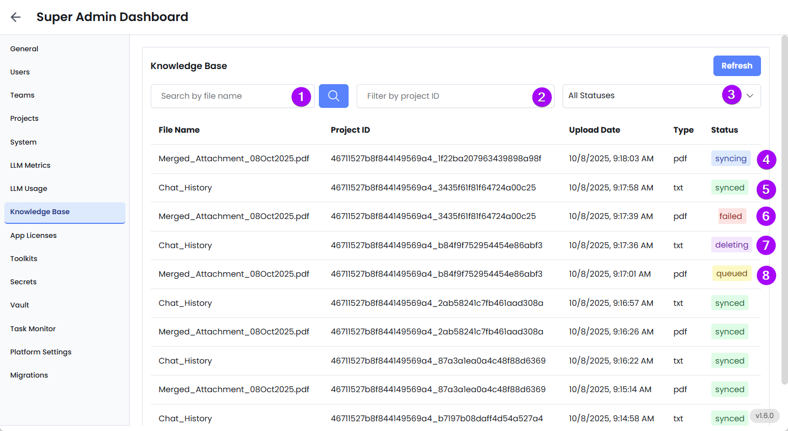

The **Knowledge Base** tab gives you complete visibility and control over all documents, files, and URLs that have been uploaded and linked to EKB projects. These files form the core knowledge that powers EKB’s AI Agents, helping them answer questions, extract data, and perform intelligent tasks using project-specific content.

This section is essential for managing the accuracy, scope, and reliability of the AI’s knowledge across your enterprise.

---

### What This Tab Lets You Do

This tab displays a searchable and filterable list of all uploaded knowledge assets, including:

- PDFs
- JSON files
- Excel documents
- Meeting notes
- Public URLs

Each record provides key information:

- **File Name**: The original name of the file or URL uploaded.
- **Project ID**: Indicates which project the file is associated with.
- **Upload Date**: Timestamp of when the file was added.
- **Type**: Format of the file (pdf, json, xlsx, meetings, url).
- **Status**: Indicates whether the file has been successfully synced or if it encountered an error.

---

1. **Search by File Name** – Quickly locate specific files.
2. **Filter by Project ID** – Narrow down files by the project they belong to.
3. **Filter by Status** – View only synced or failed files.
4. **Syncing**: File in the process of being Synced.
5. **Synced**: File was successfully processed and is available to the AI agent.
6. **Failed**: There was an error while syncing the file—possibly due to formatting issues, invalid content, or connection problems.
7. **Deleting**: File in the process of being deleted.
8. **Queued**: File that is queued for processing.

_Use this view to quickly identify which files may need to be re-uploaded or debugged._

Maintaining high-quality files in your knowledge base is crucial for optimizing the performance of EKB Agents. When your files are organized, accurate, and up-to-date, the AI can provide more precise and reliable answers to your queries. This is because the AI relies on the information within these files to generate responses, and any inaccuracies or outdated data can lead to incorrect or misleading outputs. Additionally, a well-maintained knowledge base enables the AI to process information more efficiently, resulting in faster response times. This efficiency is particularly beneficial when dealing with large volumes of data, as it allows the AI to quickly extract and summarize relevant information without unnecessary delays. By ensuring that your knowledge base is meticulously curated, you enhance the overall effectiveness and reliability of the AI, making it a more powerful tool for data analysis and decision-making. This proactive approach to file management not only improves AI performance but also enhances the user experience by providing timely and accurate information.

---

### Admin Tips

- If a file is not synced correctly, the AI will not be able to reference or use it, which may lead to incomplete answers or system errors.
- Always review the **file type** and **formatting** before uploading (e.g., ensure JSON is structured, PDFs are text-readable).
- Use meaningful file names to make searching easier.
- Regularly monitor the **Status** column to catch failures early.
- For failed files, re-upload after correcting the issue or contact support.
