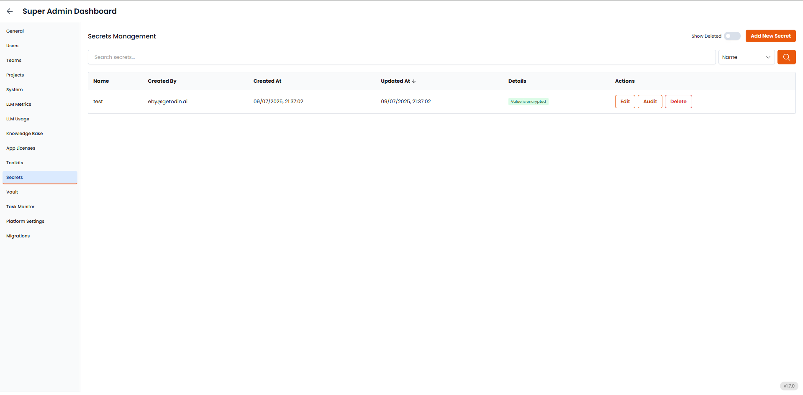

The **Secrets** tab helps you securely manage sensitive configuration data, called Secrets, that automation workflows or AI agents may need access to—like API keys, authentication tokens, or encrypted credentials. Secrets are stored in a centralized, encrypted, and access-controlled space, never hardcoded into projects or exposed in plain text. This system plays a pivotal role in safeguarding your credentials by encrypting them while they are stored, ensuring that they remain secure and inaccessible to unauthorized users.

---

**1. Add New Secrets**

Click the **Add New Secret** button to store a new piece of sensitive information. When adding a secret, you typically:

- Enter a **name** (e.g., `OPENAI_API_KEY`, `SALESFORCE_TOKEN`)
- Paste the **value** of the secret (e.g., the token or key)
- Optionally tag the secret with relevant **project scopes** or **usage contexts**

This allows your agents or flows to securely retrieve it during execution without exposing it.

**2. Search and Manage Secrets**

- Use the **search bar** to quickly find a secret by its name or value.
- Use the **dropdown filter** to sort secrets (e.g., by name, creation date).
- Toggle **Show Deleted** to view secrets that were previously removed but may still be recoverable (if soft-deleted).

Efficient management and audit capabilities help you handle large numbers of secrets securely.

**3. Edit or Delete Existing Secrets**

- **Edit**: Update the value (e.g., when rotating API keys).
- **Delete**: Remove secrets that are no longer in use (e.g., old staging credentials).

Deleted secrets may still appear in logs for compliance/audit reasons, depending on your system setup.

---

### Best Practices

- Always use this tab to store keys or tokens—never paste them directly into logic blocks or agent configs.
- Use clear, consistent names like `ZAPIER_TOKEN`, `PROD_DB_PASS`, or `SLACK_WEBHOOK`.
- Periodically review and rotate secrets for security hygiene.
- Limit who can access and update secrets based on roles and project scope.

---

### Example Use Case

Suppose you’ve built a customer support automation that needs to pull data from Salesforce. Instead of embedding your **Salesforce API key** directly into the automation:

1. Go to the Secrets tab.
2. Add a new secret called `SALESFORCE_API_KEY`.
3. Use that secret reference in the flow when authenticating with Salesforce’s API.

The workflow will securely pull the value at runtime without exposing it to users.
