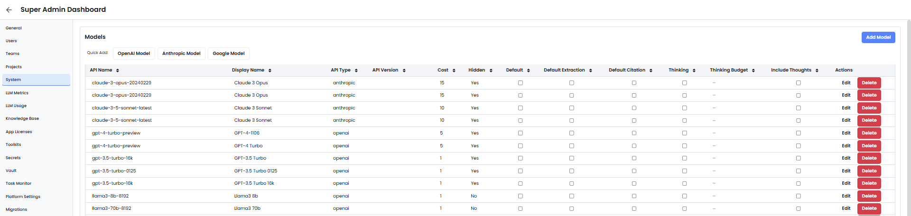

The **System** tab gives you complete control over the AI models that power EKB’s automations and workflows. This is the control center for setting up Large Language Models (LLMs), customizing which models are available for users, and managing their behavior in the system.

This tab is especially useful for organizations that use a mix of models from different providers (OpenAI, Anthropic, Google, etc.) and want to fine-tune performance, costs, and access control.

---

#

- **Add New LLM Models**: Quickly add models from providers such as OpenAI (e.g., GPT-3.5, GPT-4), Anthropic (e.g., Claude 3 Opus, Claude 3 Haiku, Claude 3.5 Sonnet), and Google (e.g., Gemini, PaLM models if enabled).
	- For each model, define:
		- **API Name**: How the system refers to the model in code.
		- **Display Name**: How users see it in the UI.
		- **API Type**: Provider (OpenAI, Anthropic, etc.).
		- **API Version**: For version control.
		- **Cost**: Custom value for internal tracking or billing logic.

- **Manage Existing Models**: All models are shown in a table with details:
	- **API Name**: Backend name used in workflows and logs.
	- **Display Name**: Friendly name visible to users.
	- **API Type**: Provider (e.g., openai, anthropic).
	- **API Version**: Version identifier.
	- **Cost**: Relative cost for accounting or token usage tracking.
	- **Hidden**: If checked, model is hidden from end users but available to admins/internal agents.
	- **Default**: Mark as default for general tasks and flows.
	- **Default Extraction**: Mark as default for information extraction workflows.

	**Actions:**
	- **Edit**: Modify model configuration (name, visibility, etc.)
	- **Delete**: Remove the model from the platform

---

### Use Cases

- **Control Costs**: Hide expensive models from general users, while still making them available for high-priority workflows.
- **Streamline Access**: Set one model as default for fast onboarding, e.g., GPT-3.5 for general Q&A, Claude for summarization, etc.
- **Run Experiments**: Add multiple versions of the same model to A/B test performance or compare output quality.

---

### Admin Tips

- Regularly review which models are enabled and who has access to them.
- Use the **Hidden** setting to restrict access to high-cost or experimental models.
- Set appropriate defaults to streamline user experience and ensure the right models are used for the right tasks.
- Monitor model usage and costs to optimize your AI infrastructure.
